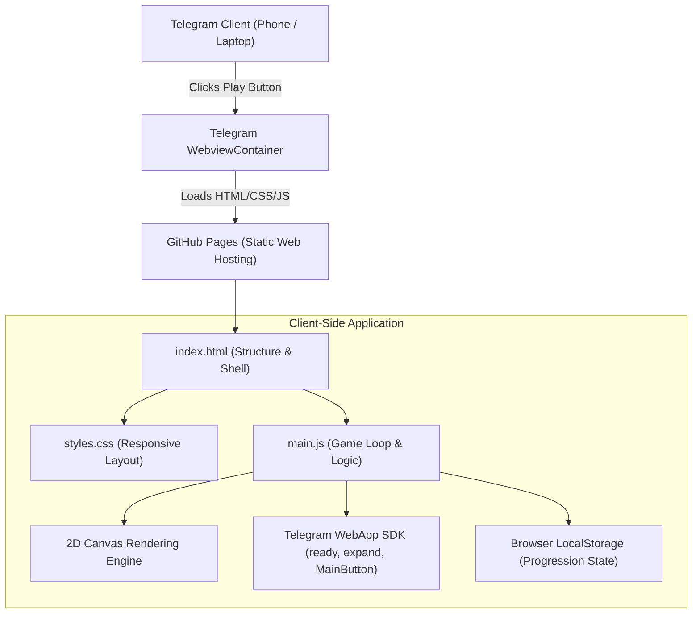
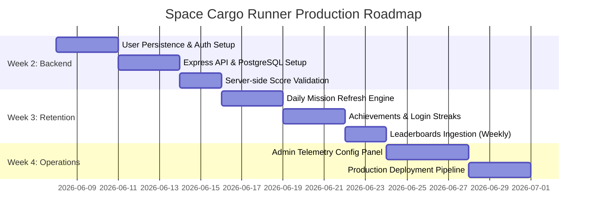

# Space Cargo Runner — Project Documentation & MVP Report

This report summarizes the current technical architecture, implementation, and deployment configuration of **Space Cargo Runner**, a legal-safe, skill-based endless runner designed for Telegram Mini App and web play.

---

## 1. Executive Summary

Space Cargo Runner is designed strictly as a **Game of Skill**, compliant with legal gaming guidelines (e.g., Indian gaming regulations) by completely avoiding chance-based monetization, random paid rewards, or betting pools. Player progression is driven purely by reaction speed, dexterity, upgrade management, and daily streak rewards.

Currently, the **Week 1 MVP** has been successfully built as a dependency-free vanilla JS static prototype. It is fully integrated with a Telegram Bot and deployed live on **GitHub Pages**, running 24/7 without local server dependencies.

---

## 2. Technical Architecture

The MVP is built on a clean, modular structure with high-performance 2D Canvas drawing. The following architecture diagram shows the current static client-side layout:



### Key Modules:
* **Gameplay Engine**: Utilizes standard `requestAnimationFrame` for a smooth game loop, rendering starfields, obstacles (asteroids, mines, lasers, satellites), and cargo pickups dynamically using raw canvas path drawing (no external sprite sheets required for fast load times).
* **Progression System**: Calculates distance score, materials, XP, levels, and coins at the end of each run. These stats are merged and saved to `localStorage` under the key `space-cargo-runner-state-v1`.
* **Telegram integration**: Automatically expands the viewport, alerts the platform that the page is ready, and dynamically shows/hides the Telegram native `MainButton` based on game state (hidden during active play, shown as "Run Again" on game-over).

---

## 3. Current Live Configuration

The project is hosted publicly and integrated with Telegram using the following production credentials:

| Parameter | Current Setting |
| :--- | :--- |
| **Telegram Bot Name** | `@voidvelocity_bot` |
| **Telegram Bot API Key** | `8877014914:AAHOIhBFXhqGFBMCKJ8X...` |
| **Repository URL** | [Krrish41/Void-Velocity](https://github.com/Krrish41/Void-Velocity) |
| **Live Web App Host** | [https://krrish41.github.io/Void-Velocity/](https://krrish41.github.io/Void-Velocity/) |
| **Menu Button Action** | Custom Web App URL configuration bound to the Live Link |

---

## 4. Development & Utility Scripts

To assist with local testing and configuration, the following helper scripts were created:

### 1. Bot Menu Button Configurator
File: [scripts/set-menu-button.js](file:///c:/Users/Krrish/Documents/Void%20Velocity/scripts/set-menu-button.js)
A lightweight Node.js script that calls the Telegram Bot API `setChatMenuButton` method to update the action button next to the chat box on the fly.
```powershell
node scripts/set-menu-button.js <TARGET_URL>
```

### 2. Tunnel Manager (Local Testing)
File: [scripts/tunnel-manager.js](file:///c:/Users/Krrish/Documents/Void%20Velocity/scripts/tunnel-manager.js)
Spawns a local `localhost.run` SSH tunnel, listens for URL changes, programmatically updates the bot button, and fires a keep-alive ping request every 20 seconds to keep local ports exposed during active debugging sessions.

---

## 5. Upcoming Milestones & Production Roadmap

As the project advances from Week 1 (Static Vertical Slice) to subsequent milestones:



### Key Focus Areas:
1. **Transition to Phaser + React**: Refactor the Canvas rendering scene into a modular Phaser 3 structure, wrapping it in a React app shell to support more complex UI elements, tabs, and sound management.
2. **Server Score Validation**: Implement seed-based verification to prevent clients from spoofing distances, speeds, or pickup counts.
3. **Database Schema Integration**: Deploy the database schema described in [docs/mvp-plan.md](file:///c:/Users/Krrish/Documents/Void%20Velocity/docs/mvp-plan.md) to persist scores, materials, and coin balances on a remote PostgreSQL database rather than local client storage.
